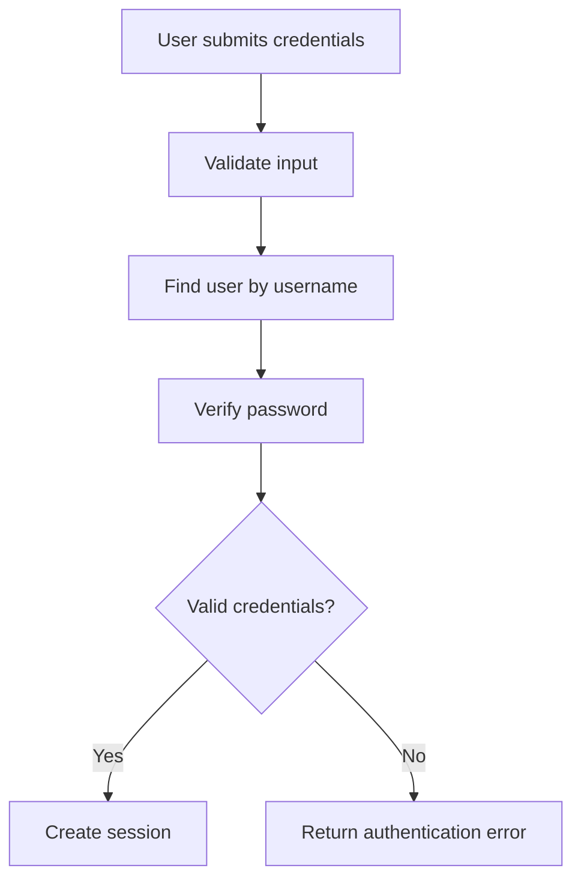

# <Document Title>

> Status: Draft / Reviewed / Approved  
> Audience: <Developers / QA / Architecture / Operations / Product>  
> Scope: <Module / Flow / Feature / Service / Job / Data Process>  
> Last updated: <YYYY-MM-DD>

---

## 1. Purpose

Describe why this document exists and what the reader should understand after reading it.

---

## 2. Scope

### In scope

- <What is covered>

### Out of scope

- <What is not covered>

---

## 3. High-Level Overview

Explain the feature, component, module, process, or flow at a high level.

Include:

- What it does
- Where it sits in the application
- Main responsibilities
- Main inputs and outputs

---

## 4. Main Components

| Component | Type | Main file/path | Responsibility | Confidence |
|---|---|---|---|---|
| `<component>` | `<service/module/class/job/controller/etc.>` | `<path>` | `<responsibility>` | Confirmed / Inferred / Ambiguous |

---
## 5. Processing Flow

This section describes how the login process works from the moment the user submits credentials until the application creates or rejects the session.

---
## 6. Data Structures

## 7. Dependencies

## 8. Design Notes

Describe relevant design observations.

Include when applicable:

-Architectural style
-Coupling
-Cohesion
-Error handling
-Configuration handling
-Scalability concerns
-Testability
-Technical debt
-Legacy constraints

## 9. Sources Consulted
-Graphify queries
graphify query "<query 1>"
graphify query "<query 2>"

-Files reviewed
<path/to/file>
<path/to/file>

## 10. Open Questions
<Question that could not be confirmed from Graphify or source code>
