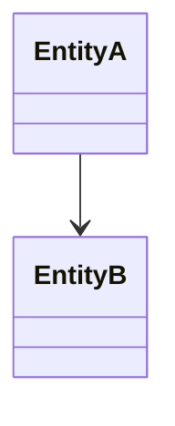
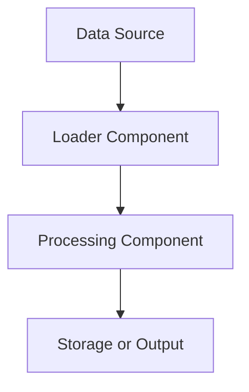

# Template: TDD Section 2 — Application Architecture

Use this template to generate section **2. Application Architecture** of a Technical Design Document for a brownfield system.

The output must be written in **English**, in **Markdown**, and saved as:

`docs/<document-name>/02-application-architecture.md`

The section must be based primarily on:

- Graphify query results
- direct repository evidence, when needed
- explicitly marked reasonable inferences

If information is unavailable, write:

`Not identified in the graph.`

Do not invent components, flows, dependencies, data structures, patterns, or diagrams.

---

## Required Output Structure

## 2. Application Architecture

### 2.1 Overview

Describe the high-level architecture of the application.

Include, if identified:

- application type
- architectural style
- main modules or layers
- entry points
- main technical or business responsibilities

### 2.2 Application Components

Describe the main components identified in the graph.

Recommended table:

| Component | Type | Responsibility | Relationships | Evidence |
|---|---|---|---|---|

### 2.3 Internal Organization

Describe how the application is organized internally.

Include, if identified:

- folder or package structure
- layering
- module boundaries
- separation of concerns
- relevant naming or grouping conventions

### 2.4 Data Structure

Describe the main data structures identified in the graph.

Include, if identified:

- domain entities
- DTOs
- persistence models
- schemas
- repositories
- data access components
- relationships between data structures

Recommended table:

| Data Structure | Type | Responsibility | Related Components | Evidence |
|---|---|---|---|---|

### 2.5 Architecture Diagram

Include Mermaid diagrams only when relationships are supported by Graphify or repository evidence.

Do not include hypothetical diagrams.

### 2.5.1 Component and Relationship Diagram

Show the main components and their relationships, if identified.

Example format:

	
### 2.5.2 Data Structure Diagram

Show relationships between data structures, if identified.

Example format:

### 2.5.3 Data Loading Diagram

Show data loading, import, ingestion, ETL, synchronization, or initialization flows, if identified.

Example format:

### 2.6 Processing Flow

Describe the main processing flow or flows identified in the application.

Include, if identified:

entry point
trigger or input
orchestration logic
services or handlers
data transformations
persistence or external calls
output or response

Use numbered steps when useful.

### 2.7 External Dependencies

Describe external dependencies identified in the graph.

### 2.8 Design Considerations

Describe relevant design considerations based on the observed architecture.

Separate clearly:

observed considerations
inferred considerations
gaps and risks

### 2.8.1 Identified Patterns

Describe architectural, design, or implementation patterns identified in the graph.

### 2.9 Source of Information and Gaps

State that the section is based on:

the code graph generated under graphify-out/
graphify query results
direct repository evidence, if used
explicitly marked inferences

List:

-information not identified in the graph
-assumptions made
-areas requiring manual validation

### Writing Rules
-Write in English.
-Use clear technical language.
-Use Markdown.
-Prefer tables for components, data structures, dependencies, and patterns.
-Use Mermaid only when supported by evidence.
-Mark missing information explicitly.
-Mark inferences explicitly.
-Do not include execution logs or agent reasoning.