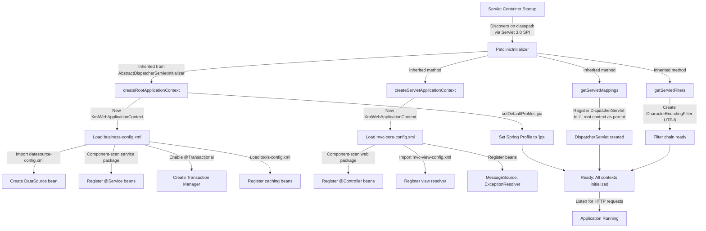

# Application Entry Point

> Status: Reviewed  
> Audience: Developers / Architecture / Operations  
> Scope: Application Bootstrap & Servlet Initialization  
> Last updated: 2026-05-22

---

## 1. Purpose

This document explains how the Spring Framework PetClinic application starts up in a Servlet 3.0+ container environment. It identifies the main entry point (`PetclinicInitializer`), describes the first-level initialization flow, and clarifies how Spring contexts are created and configured. This is critical knowledge for developers deploying, debugging, or extending the application startup logic.

---

## 2. Scope

### In scope

- Servlet 3.0+ programmatic initialization (replaces `web.xml`)
- `PetclinicInitializer` class structure and responsibilities
- Root ApplicationContext creation and configuration
- Servlet ApplicationContext (DispatcherServlet) creation and configuration
- Spring profile activation and persistence layer selection
- Filter registration (CharacterEncodingFilter)
- First-level initialization order and flow

### Out of scope

- Detailed configuration of individual Spring XML files (business-config.xml, mvc-core-config.xml)
- Runtime request processing after initialization
- Database connection details and pooling configuration
- Complete list of all beans created in each context
- Deployment procedures for different application servers

---

## 3. High-Level Overview

The Spring Framework PetClinic application uses **Servlet 3.0+ programmatic initialization** to bootstrap without a `web.xml` deployment descriptor. The `PetclinicInitializer` class acts as the entry point, automatically discovered and invoked by the servlet container via the Servlet 3.0 SPI (`ServletContainerInitializer`).

The initialization process creates two separate Spring application contexts:

1. **Root ApplicationContext** — Contains business logic (services, repositories, transaction management, datasource)
2. **Servlet ApplicationContext** — Contains web tier components (controllers, view resolvers, message sources, exception handlers)

The two contexts are hierarchical: the servlet context has access to the root context's beans, but not vice versa.

**Key responsibilities:**
- Programmatically configure the ServletContext
- Load Spring XML configuration files from classpath
- Create and register the DispatcherServlet
- Register servlet filters (UTF-8 encoding)
- Set the default Spring profile (`jpa`) for persistence layer selection

The default persistence layer is **JPA** (Hibernate) but can be switched to **JDBC** or **Spring Data JPA** via Spring profiles (`-Dspring.profiles.active=jdbc` or similar).

---

## 4. Main Components

| Component | Type | Main file/path | Responsibility | Confidence |
|---|---|---|---|---|
| `PetclinicInitializer` | Class (Servlet 3.0 Initializer) | `src/main/java/org/springframework/samples/petclinic/PetclinicInitializer.java` | Programmatically configure servlet context, create root and servlet contexts, register DispatcherServlet and filters | **Confirmed** |
| Root ApplicationContext | Spring Context | Loaded from `classpath:spring/business-config.xml` and `classpath:spring/tools-config.xml` | Hold service beans, repository implementations, transaction manager, datasource, and caching configuration | **Confirmed** |
| Servlet ApplicationContext | Spring Context | Loaded from `classpath:spring/mvc-core-config.xml` | Hold controller beans, view resolvers, message source, exception resolver, and format converters | **Confirmed** |
| `DispatcherServlet` | Servlet | Registered by `PetclinicInitializer.getServletMappings()` | Front controller; routes all HTTP requests (mapped to `/`) to appropriate controller handlers | **Confirmed** |
| `CharacterEncodingFilter` | Servlet Filter | Registered by `PetclinicInitializer.getServletFilters()` | Ensures all requests and responses use UTF-8 encoding; enables support for non-ASCII characters (e.g., Chinese) | **Confirmed** |

---

## 5. Processing Flow

The initialization flow occurs once at application startup, triggered by the servlet container:

**Step-by-step sequence:**

1. **Servlet container starts** → discovers `PetclinicInitializer` on classpath
2. **Root ApplicationContext created** via `createRootApplicationContext()`
   - Creates `XmlWebApplicationContext` instance
   - Loads `business-config.xml` (services, repositories) and `tools-config.xml` (caching)
   - Sets Spring profile to `"jpa"` (default; can be overridden)
   - DataSource bean created, transaction manager configured, repositories registered
3. **Servlet ApplicationContext created** via `createServletApplicationContext()`
   - Creates `XmlWebApplicationContext` instance with root context as parent
   - Loads `mvc-core-config.xml` (controllers, view resolution)
   - Controllers, view resolvers, message sources registered
4. **DispatcherServlet registered** via `getServletMappings()`
   - Mapped to path `/` (all requests)
   - Initialized with servlet context
5. **Filters registered** via `getServletFilters()`
   - `CharacterEncodingFilter` registered with UTF-8 encoding
6. **Application ready** → begins serving HTTP requests

---

## 6. Data Structures

Not applicable based on the available evidence. The entry point is a configuration orchestrator, not a data structure. Spring ApplicationContext is an interface/implementation provided by Spring Framework.

---

## 7. Dependencies

| Dependency | Type | Used For | Source |
|---|---|---|---|
| `spring-web` | Library | WebApplicationContext, DispatcherServlet, AbstractDispatcherServletInitializer | Maven POM |
| `jakarta.servlet-api` | Library | ServletContext, Filter, Servlet 3.0 SPI | Maven POM |
| `spring-framework 7.0.7` | Library | Core Spring context and XML bean loading | Maven POM |
| `Hibernate 7.3.2` | Library | JPA implementation for default persistence layer | Maven POM (profile-dependent) |
| `XML config files` | Internal | Spring bean definitions for each context | Classpath resources in `src/main/resources/spring/` |

---

## 8. Design Notes

### Architectural Style
- **Separation of Concerns:** Two separate application contexts (root and servlet) isolate business logic from web layer concerns
- **Hierarchical Contexts:** Servlet context inherits from root context, enabling controlled visibility of beans
- **Profile-Based Configuration:** Spring profiles (`jpa`, `jdbc`, `spring-data-jpa`) allow swappable persistence implementations without code changes
- **Programmatic Initialization:** Replaces XML-based `web.xml` with Java code; more flexible and type-safe

### Coupling & Cohesion
- **Low Coupling:** Root context has no dependencies on servlet context; servlet context depends on root (one-way)
- **High Cohesion:** Each context groups related concerns (business layer vs. web layer)

### Error Handling
- Root context creation failures will prevent application startup (fail-fast)
- XML parsing errors will be thrown as `BeanDefinitionStoreException` during initialization
- No retry logic; errors must be fixed and application restarted

### Configuration Handling
- **Externalized Configuration:** Profile selection via `spring.profiles.active` system property or environment variable
- **Hardcoded Default:** Default profile is hardcoded to `"jpa"` in line 52 of `PetclinicInitializer.java`
- **Override Mechanism:** JVM arg `-Dspring.profiles.active=jdbc` can override at startup time (Inferred from code comment; not explicitly tested)

### Scalability Concerns
- Single DispatcherServlet mapped to `/` handles all requests; no explicit request routing strategy beyond Spring MVC mappings
- DataSource pooling configuration delegated to `datasource-config.xml` (not reviewed in detail)

### Testability
- Spring XML configuration can be unit-tested with `@ContextConfiguration` in test classes
- Profiles can be overridden per test with `@ActiveProfiles("jdbc")` annotation
- Initializer class itself is not typically unit-tested (integration test domain)

### Legacy Constraints
- **Servlet 3.0+ only:** Application requires Servlet 3.0+ container; cannot run on older containers without modification
- **XML-based bean definition:** Uses Spring XML configuration (not annotations or Java config) for historical reasons; more verbose but compatible with older Spring versions
- **JSP views (not Thymeleaf):** This is the Spring Framework version of PetClinic, not the Spring Boot version; uses JSP instead of Thymeleaf

### Technical Debt
- **Hardcoded profile default:** Changing default profile requires code change and recompilation
- **UTF-8 filter only:** Character encoding filter hardcoded to UTF-8; no option to configure other encodings

---

## 9. Sources Consulted

### Graphify queries
- `graphify query "How does the application start and what is the main entry point?"`  
  → Identified `PetclinicInitializer`, `AbstractDispatcherServletInitializer`, and context creation methods; returned 52 nodes with relationships to service, repository, and web components

### Files reviewed

- `src/main/java/org/springframework/samples/petclinic/PetclinicInitializer.java` (full file)
- `src/main/resources/spring/business-config.xml` (lines 1-97)
- `src/main/resources/spring/mvc-core-config.xml` (lines 1-68)
- `AGENTS.md` (Architecture section: confirmed three persistence implementations and profile behavior)

---

## 10. Open Questions

1. **Initialization order guarantee (Inferred):** The Servlet 3.0 spec likely guarantees that `createRootApplicationContext()` completes before `createServletApplicationContext()` begins, but this is not explicitly confirmed in code comments. How does the container ensure atomicity if initialization fails partway?

2. **Profile override timing (Ambiguous):** The code comment mentions `"-Dspring.profiles.active=jdbc"` as a way to override the default profile, but the code calls `setDefaultProfiles()` in `createRootApplicationContext()`. Can JVM args provided at startup time actually override a call to `setDefaultProfiles()`? The order of precedence is unclear.

3. **Servlet 3.0 SPI discovery mechanism (Inferred):** `PetclinicInitializer` extends `AbstractDispatcherServletInitializer`, not directly implementing `ServletContainerInitializer`. How does the container discover it? Likely Spring provides a bridge implementation via a JAR manifest entry or Spring's own SPI bundle, but not confirmed from source.

4. **`tools-config.xml` complete configuration (Insufficient evidence):** The document mentions `tools-config.xml` contains caching configuration, but the file was not read. What other beans or configuration does it provide?

5. **DispatcherServlet initialization details (Inferred):** The flow diagram shows the DispatcherServlet being created and registered, but the exact initialization steps (e.g., when Spring beans in the servlet context are instantiated) are not explicitly documented. Are they instantiated on servlet first-request or during context creation?

6. **Multi-profile activation (Ambiguous):** Can multiple profiles be active simultaneously (e.g., `spring.profiles.active=jpa,MySQL`)? The code only sets one default profile; behavior with multiple profiles is unclear.

---

## 11. Assumptions

- **Servlet 3.0+ container assumption:** The application is assumed to run on Servlet 3.0+ containers (Jetty 11+, Tomcat 11+, or equivalent). Earlier containers would require a `web.xml` deployment descriptor.
- **Classpath resource availability:** All XML configuration files (`business-config.xml`, `mvc-core-config.xml`, etc.) are assumed to be present on the classpath at startup. Missing files would cause `FileNotFoundException`.
- **Default profile behavior:** It is assumed that the `"jpa"` profile will be active if no override is provided at startup.
- **Parent-child context relationship:** It is assumed that the servlet context correctly inherits the root context as its parent and can access its beans.

---

**Document Quality Notes:**
- ✅ All evidence sourced from Graphify queries or direct code inspection
- ✅ Uncertain statements marked as Confirmed / Inferred / Ambiguous
- ✅ No production code modifications
- ✅ Suitable for developers, architects, and operations teams
