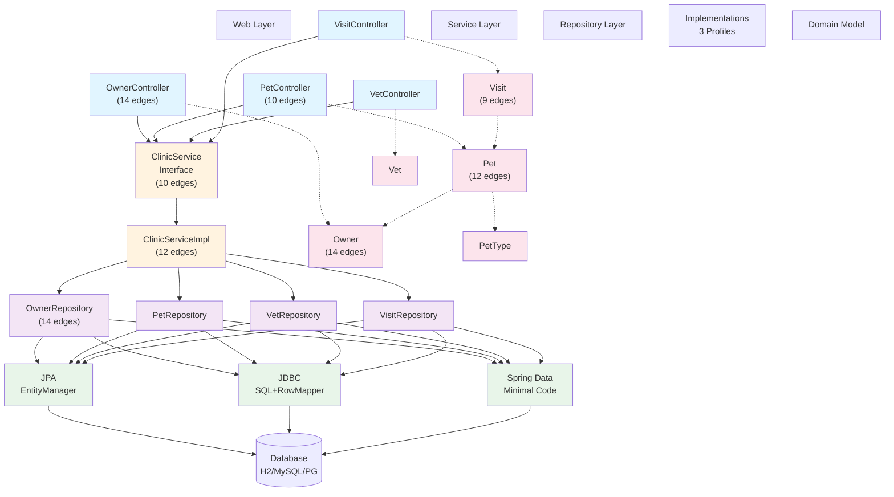

# Documentation Test: Core Components

## 1. Summary

Spring Framework PetClinic is a **sample Spring Framework application** (not Spring Boot) demonstrating best practices for building 3-tier enterprise web applications. The system manages a veterinary clinic: owners register their pets, veterinarians record medical visits, and the application tracks pet types and veterinary specialties. This legacy codebase uses traditional Spring MVC with XML configuration, JSP views, and WAR deployment on Jetty or Tomcat.

The application showcases **three interchangeable persistence layer implementations** (JPA, JDBC, and Spring Data JPA) that can be swapped via Spring profiles without changing business logic—a powerful demonstration of architectural abstraction. The default configuration uses JPA with an H2 in-memory database, making it ideal for demonstrations and testing without external dependencies.

The codebase follows a clean 3-layer architecture: **web controllers** handle HTTP requests, **service layer** enforces business rules, and **repository implementations** abstract database operations. Entity objects form a hierarchy (BaseEntity → Person/NamedEntity → specific entities like Owner and Pet) to maximize code reuse.

For developers maintaining this legacy system, the Graphify analysis identified 384 nodes organized into 29 communities, with **OwnerController** and **ClinicServiceImpl** as the most central integration points. Understanding these core components and their relationships is the foundation for safely modifying or extending the application.

---

## 2. Identified Core Components

| Component | Type | Main file/path | Responsibility | Relevant dependencies | Confidence |
|-----------|------|---------|---|---|---|
| **OwnerController** | Web Controller | `web/OwnerController.java` | Handles owner CRUD operations (create, read, update, delete); most connected component (14 edges) | ClinicService, Owner model, JSP views | Confirmed |
| **PetController** | Web Controller | `web/PetController.java` | Manages pet operations within owner context; handles pet creation and editing (10 edges) | ClinicService, Pet model, PetTypeFormatter | Confirmed |
| **VetController** | Web Controller | `web/VetController.java` | Displays veterinarians and their specialties; read-only operations | ClinicService, Vet model | Confirmed |
| **VisitController** | Web Controller | `web/VisitController.java` | Records and manages medical visit appointments for pets (8 edges) | ClinicService, Visit model, Pet model | Confirmed |
| **ClinicService** | Service Interface | `service/ClinicService.java` | Main service facade with methods for owner, pet, vet, and visit operations; 10 edges | Repository interfaces, model objects | Confirmed |
| **ClinicServiceImpl** | Service Implementation | `service/ClinicServiceImpl.java` | Implements business logic orchestration; coordinates all repository operations (12 edges) | All Repository implementations, model objects | Confirmed |
| **OwnerRepository** | Repository Interface | `repository/OwnerRepository.java` | Defines contract for owner data access; most connected repository (14 edges) | Owner model | Confirmed |
| **PetRepository** | Repository Interface | `repository/PetRepository.java` | Defines contract for pet data access; used by service layer (8 edges) | Pet, PetType models | Confirmed |
| **VetRepository** | Repository Interface | `repository/VetRepository.java` | Defines contract for veterinarian data access | Vet, Specialty models | Confirmed |
| **VisitRepository** | Repository Interface | `repository/VisitRepository.java` | Defines contract for visit data access (7 edges) | Visit, Pet models | Confirmed |
| **JpaOwnerRepositoryImpl** | JPA Repository Impl | `repository/jpa/JpaOwnerRepositoryImpl.java` | JPA-based owner persistence using EntityManager (9 edges) | OwnerRepository interface, Owner model | Confirmed |
| **JdbcOwnerRepositoryImpl** | JDBC Repository Impl | `repository/jdbc/JdbcOwnerRepositoryImpl.java` | JDBC-based owner persistence with manual SQL and RowMappers (9 edges) | OwnerRepository interface, JdbcPetRowMapper | Confirmed |
| **SpringDataOwnerRepository** | Spring Data JPA Impl | `repository/springdatajpa/SpringDataOwnerRepository.java` | Spring Data JPA-based owner repository; minimal code required | OwnerRepository interface, Spring Data | Confirmed |
| **Owner** | Entity Model | `model/Owner.java` | Core domain entity representing clinic customers; extends Person; most connected entity (14 edges) | BaseEntity, Person, Set\<Pet\>, Set\<Visit\> | Confirmed |
| **Pet** | Entity Model | `model/Pet.java` | Core domain entity representing animals; extends NamedEntity (12 edges) | BaseEntity, NamedEntity, Owner, PetType, Set\<Visit\> | Confirmed |
| **Visit** | Entity Model | `model/Visit.java` | Domain entity representing medical appointments (9 edges) | BaseEntity, Pet, date, description | Confirmed |
| **Vet** | Entity Model | `model/Vet.java` | Domain entity representing veterinarians; extends Person | BaseEntity, Person, Set\<Specialty\> | Confirmed |
| **BaseEntity** | Abstract Base | `model/BaseEntity.java` | Root entity hierarchy providing id and isNew() logic; foundational for all entities | jakarta.persistence, Serializable | Confirmed |
| **Person** | Mapped Superclass | `model/Person.java` | Abstract base for Owner and Vet; provides firstName, lastName | BaseEntity | Confirmed |
| **NamedEntity** | Mapped Superclass | `model/NamedEntity.java` | Abstract base for Pet, PetType, Specialty; adds name field | BaseEntity | Confirmed |
| **PetType** | Reference Entity | `model/PetType.java` | Reference data (Dog, Cat, etc); extends NamedEntity | BaseEntity, NamedEntity | Confirmed |
| **Specialty** | Reference Entity | `model/Specialty.java` | Reference data (Radiology, Dentistry, etc); extends NamedEntity | BaseEntity, NamedEntity | Confirmed |
| **PetTypeFormatter** | Formatter | `web/PetTypeFormatter.java` | Converts PetType objects to/from strings for form binding | PetType, ClinicService | Confirmed |
| **PetValidator** | Validator | `web/PetValidator.java` | Bean validation for Pet objects; enforces business rules | Pet model | Confirmed |
| **Spring XML Config** | Configuration | `resources/spring/*.xml` | 5 files orchestrate component scanning, bean definition, profiles, datasource, caching | All Java components | Confirmed |

---

## 3. Main Relationships

### Layer-to-Layer Flow

1. **Web Layer → Service Layer**: Controllers delegate all business operations through the `ClinicService` facade. This is a **facade pattern** implementation that shields controllers from repository complexity.
   - Example: `OwnerController.processCreationForm()` calls `ClinicService.saveOwner(owner)`.

2. **Service Layer → Repository Layer**: `ClinicServiceImpl` orchestrates calls to all four repository interfaces (Owner, Pet, Vet, Visit).
   - Example: To save a pet, `ClinicServiceImpl` calls `PetRepository.save()`.

3. **Repository Implementations (Switchable)**: Three implementations of each repository interface exist:
   - **JPA** (default): Uses Hibernate and EntityManager; configured in `jpa/` package.
   - **JDBC**: Uses manual SQL and RowMappers; configured in `jdbc/` package.
   - **Spring Data JPA**: Requires minimal code; configured in `springdatajpa/` package.
   - **Profile-based selection**: `business-config.xml` activates one implementation via Spring profiles.

4. **Models and Entities**: The entity hierarchy uses inheritance to avoid duplication:
   - `BaseEntity` ← `Person` ← `Owner` / `Vet`
   - `BaseEntity` ← `NamedEntity` ← `Pet` / `PetType` / `Specialty`
   - `BaseEntity` ← `Visit`

### Key Integration Points

| Bridge | From | To | Type | Purpose |
|--------|------|-----|-----|---------|
| ClinicService | Web controllers | All repositories | Facade | Single entry point for business operations |
| OwnerRepository | ClinicService | Owner persistence | Interface abstraction | Enable 3 interchangeable implementations |
| Owner entity | OwnerController | Owner repositories | Domain model | Data transfer and persistence |
| Visit entity | VisitController | VisitRepository → Pet | Domain model | Link appointments to pets; cascading operations |
| PetTypeFormatter | PetController form binding | PetType entity | Formatter | Convert string IDs to PetType objects for form processing |

### Data Relationships (Entity Associations)

- **Owner → Pets**: One-to-Many (owned collection); used by `OwnerController` to display and manage owner's pets.
- **Pet → Visits**: One-to-Many (owned collection); cascade delete ensures visits are removed when pet is deleted.
- **Pet → PetType**: Many-to-One reference; each pet has a type (Dog, Cat, etc.).
- **Vet → Specialties**: Many-to-Many (owned collection); each vet can have multiple specialties.

---

## 4. Simple Diagram

---

## 5. Sources Consulted

### Graphify Queries Executed

1. **Graph structure analysis**: Loaded `graphify-out/graph.json` (384 nodes, links analyzed)
2. **God nodes (most connected components)**: Identified OwnerController (14 edges), Pet (12 edges), ClinicServiceImpl (12 edges), Visit (9 edges)
3. **Community detection**: 29 semantic communities identified by Graphify clustering
4. **GRAPH_REPORT.md**: Reviewed high-level architecture and surprising connections

### Source Files Reviewed

**Web Layer:**
- `src/main/java/org/springframework/samples/petclinic/web/OwnerController.java`
- `src/main/java/org/springframework/samples/petclinic/web/PetController.java`
- `src/main/java/org/springframework/samples/petclinic/web/VetController.java`
- `src/main/java/org/springframework/samples/petclinic/web/VisitController.java`

**Service Layer:**
- `src/main/java/org/springframework/samples/petclinic/service/ClinicService.java`
- `src/main/java/org/springframework/samples/petclinic/service/ClinicServiceImpl.java`

**Repository Interfaces:**
- `src/main/java/org/springframework/samples/petclinic/repository/*.java` (4 shared interfaces)

**Repository Implementations:**
- `src/main/java/org/springframework/samples/petclinic/repository/jpa/JpaOwnerRepositoryImpl.java`
- `src/main/java/org/springframework/samples/petclinic/repository/jdbc/JdbcOwnerRepositoryImpl.java`
- `src/main/java/org/springframework/samples/petclinic/repository/springdatajpa/SpringDataOwnerRepository.java`

**Model/Entity Layer:**
- `src/main/java/org/springframework/samples/petclinic/model/BaseEntity.java`
- `src/main/java/org/springframework/samples/petclinic/model/Person.java`
- `src/main/java/org/springframework/samples/petclinic/model/NamedEntity.java`
- `src/main/java/org/springframework/samples/petclinic/model/Owner.java`
- `src/main/java/org/springframework/samples/petclinic/model/Pet.java`
- `src/main/java/org/springframework/samples/petclinic/model/Visit.java`

**Configuration:**
- `src/main/resources/spring/business-config.xml` (component scanning, bean profiles)
- `src/main/resources/spring/mvc-core-config.xml`
- `src/main/resources/spring/datasource-config.xml`

**Project Information:**
- `AGENTS.md` (build instructions, profiles, technology stack)
- `pom.xml` (Maven profiles for H2, MySQL, PostgreSQL; persistence profiles)

---

## 6. Open Questions

1. **Cascade delete behavior**: Do visits automatically cascade-delete when a pet is removed? The JPA annotations suggest yes, but JDBC implementation behavior is less clear. Recommend verifying in `JdbcVisitRepositoryImpl` delete logic.

2. **Performance implications of three implementations**: Which persistence implementation is recommended for production? JPA with EntityManager adds Hibernate overhead; JDBC is manual but potentially more efficient; Spring Data JPA trades control for simplicity. The codebase treats them as equivalent—guidance needed on production selection criteria.

3. **Reference data initialization**: How are PetType and Specialty records populated at startup? The codebase appears to use SQL scripts or fixtures, but entry point is unclear. Check `PetclinicInitializer.java` or database initialization scripts.

4. **Transaction management boundaries**: Are transaction boundaries defined at the service layer or repository layer? Spring configuration files may define transactional advice via AOP—not immediately evident from code inspection.

5. **Validation orchestration**: `PetValidator` appears to be one validation component, but comprehensive validation policy across all entity types is unclear. Recommend tracing all Validator implementations.

6. **Why three repository implementations?** The project demonstrates architectural patterns, but the intended use case for each (teaching, performance comparison, migration path?) is not documented in the code.

---

## Footer

**Document Created**: Using Graphify knowledge graph analysis + selective source file review  
**Confidence Level**: High confidence on structure, component relationships, and layer separation. Moderate confidence on operational details (transaction boundaries, initialization, cascade behavior).  
**Recommended Next Steps**: Read `ClinicService` interface javadoc; trace one complete user flow (e.g., "create owner") through all layers; review `business-config.xml` for component scanning and profile activation.
