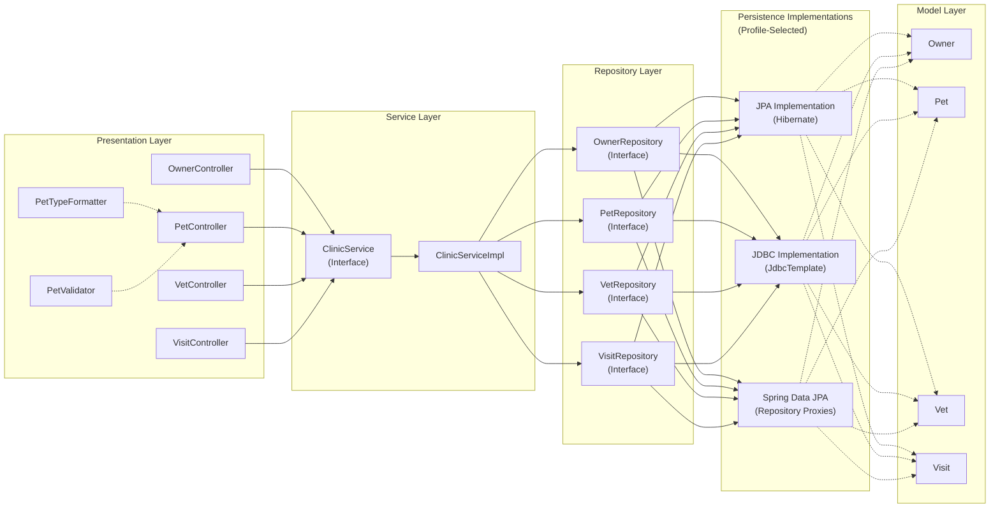
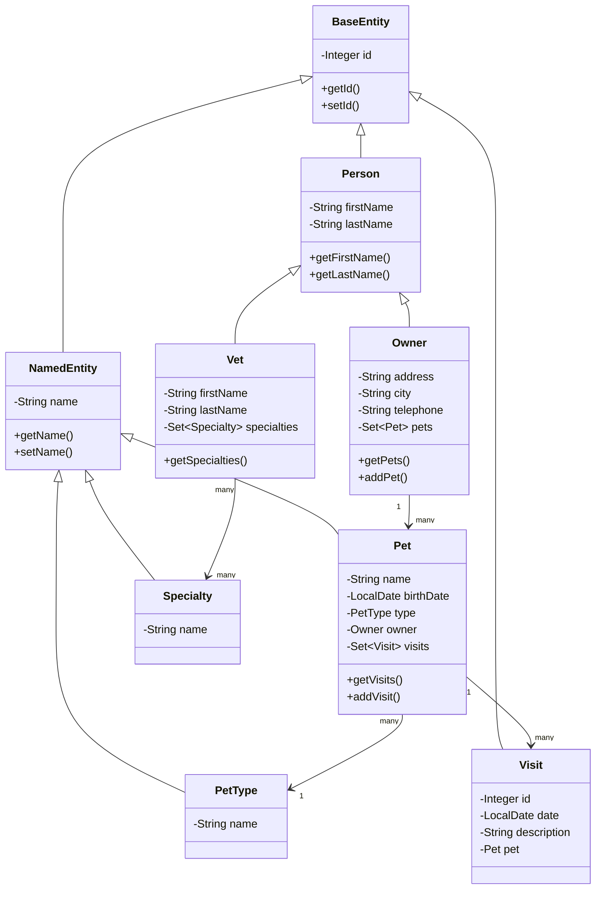
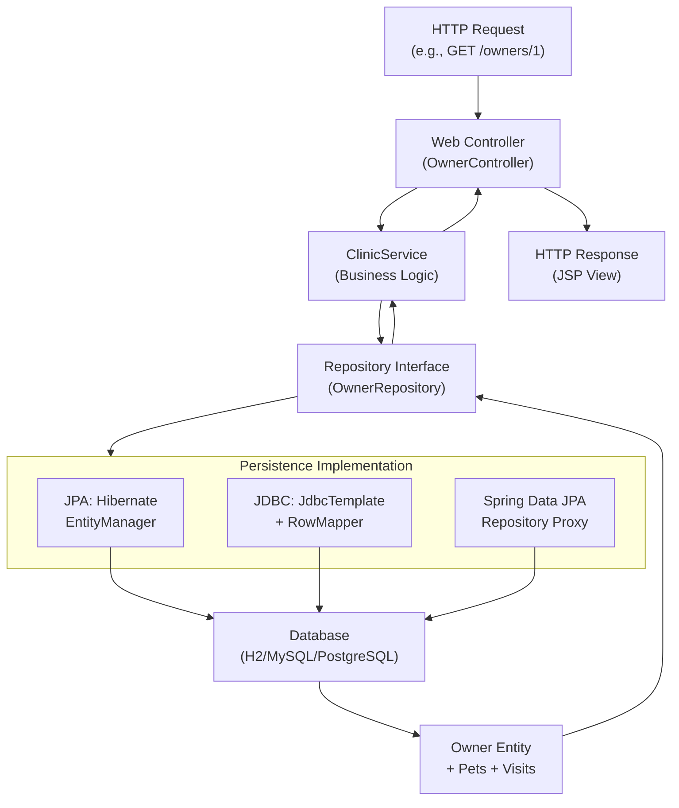

# 2. Application Architecture

## 2.1 Overview

Spring Framework PetClinic is a **web-based veterinary clinic management application** built on the **Spring Framework 7.0.7** (not Spring Boot) using **XML-based configuration** and **JSP views**. The application follows a **classic three-tier layered architecture** with a **pluggable persistence layer** that supports three different implementations.

### Application Type
- **Web Application** (WAR packaging for Jetty 11+ or Tomcat 11+)
- **Spring MVC** framework (not Spring Boot)
- **Servlet 3.0+** programmatic configuration (replaces traditional web.xml)

### Architectural Style
- **Layered Architecture** with clear separation of concerns:
  - **Presentation Layer** (Web Controllers, JSP Views, Formatters, Validators)
  - **Service Layer** (Business logic facade)
  - **Persistence Layer** (Repository pattern with three pluggable implementations)
  - **Model Layer** (Domain entities with Jakarta EE annotations)

### Main Modules
1. **Web Layer** (`web/`) - HTTP request handling and view rendering
2. **Service Layer** (`service/`) - Business logic orchestration
3. **Repository Layer** (`repository/`) - Data access abstraction with three implementations
4. **Model Layer** (`model/`) - Domain entities and value objects
5. **Utility Layer** (`util/`) - Cross-cutting utilities

### Entry Points
- **`PetclinicInitializer`** - Servlet 3.0+ programmatic configuration entry point
  - Creates root application context from `business-config.xml` and `tools-config.xml`
  - Creates servlet application context from `mvc-core-config.xml`
  - Registers `DispatcherServlet` and character encoding filter
  - Sets default Spring profile to `jpa` (configurable via `-Dspring.profiles.active`)

### Main Technical Responsibilities
- **Owner Management** - Create, read, update owners and their contact information
- **Pet Management** - Register pets, track pet types, manage pet-owner relationships
- **Veterinarian Management** - Maintain vet profiles and specialties
- **Visit Tracking** - Record and retrieve veterinary visits for pets

---

## 2.2 Application Components

| Component | Type | Responsibility | Relationships | Evidence |
|---|---|---|---|---|
| **ClinicService** | Service Interface | Facade for all business operations; single point of entry for controllers | Used by all web controllers; delegates to repositories | `src/main/java/org/springframework/samples/petclinic/service/ClinicService.java` |
| **ClinicServiceImpl** | Service Implementation | Implements business logic; orchestrates repository calls | Implements `ClinicService`; depends on all repository interfaces | `src/main/java/org/springframework/samples/petclinic/service/ClinicServiceImpl.java` |
| **OwnerController** | Web Controller | Handles owner-related HTTP requests (find, create, update) | Depends on `ClinicService`; uses `PetValidator` | `src/main/java/org/springframework/samples/petclinic/web/OwnerController.java` |
| **PetController** | Web Controller | Handles pet-related HTTP requests (create, update) | Depends on `ClinicService`; uses `PetTypeFormatter` | `src/main/java/org/springframework/samples/petclinic/web/PetController.java` |
| **VetController** | Web Controller | Handles veterinarian listing requests | Depends on `ClinicService` | `src/main/java/org/springframework/samples/petclinic/web/VetController.java` |
| **VisitController** | Web Controller | Handles visit creation and management | Depends on `ClinicService` | `src/main/java/org/springframework/samples/petclinic/web/VisitController.java` |
| **CrashController** | Web Controller | Demonstrates error handling (test/demo purposes) | Standalone; triggers exceptions | `src/main/java/org/springframework/samples/petclinic/web/CrashController.java` |
| **OwnerRepository** | Repository Interface | Abstraction for owner data access | Implemented by `JpaOwnerRepositoryImpl`, `JdbcOwnerRepositoryImpl`, `SpringDataOwnerRepository` | `src/main/java/org/springframework/samples/petclinic/repository/OwnerRepository.java` |
| **PetRepository** | Repository Interface | Abstraction for pet data access | Implemented by `JpaPetRepositoryImpl`, `JdbcPetRepositoryImpl`, `SpringDataPetRepository` | `src/main/java/org/springframework/samples/petclinic/repository/PetRepository.java` |
| **VetRepository** | Repository Interface | Abstraction for veterinarian data access | Implemented by `JpaVetRepositoryImpl`, `JdbcVetRepositoryImpl`, `SpringDataVetRepository` | `src/main/java/org/springframework/samples/petclinic/repository/VetRepository.java` |
| **VisitRepository** | Repository Interface | Abstraction for visit data access | Implemented by `JpaVisitRepositoryImpl`, `JdbcVisitRepositoryImpl`, `SpringDataVisitRepository` | `src/main/java/org/springframework/samples/petclinic/repository/VisitRepository.java` |
| **PetTypeFormatter** | Web Formatter | Converts `PetType` objects to/from strings for form binding | Used by Spring MVC for data binding | `src/main/java/org/springframework/samples/petclinic/web/PetTypeFormatter.java` |
| **PetValidator** | Web Validator | Validates pet form data (e.g., birth date, name) | Used by `PetController` | `src/main/java/org/springframework/samples/petclinic/web/PetValidator.java` |
| **EntityUtils** | Utility | Helper methods for entity operations (e.g., `getById()`) | Used across service and repository layers | `src/main/java/org/springframework/samples/petclinic/util/EntityUtils.java` |

---

## 2.3 Internal Organization

### Package Structure

```
src/main/java/org/springframework/samples/petclinic/
├── model/                    # Domain entities and value objects
│   ├── BaseEntity.java       # Abstract base with ID
│   ├── NamedEntity.java      # Abstract base with name
│   ├── Person.java           # Abstract person entity
│   ├── Owner.java            # Owner entity (extends Person)
│   ├── Pet.java              # Pet entity (extends NamedEntity)
│   ├── PetType.java          # Pet type reference data
│   ├── Vet.java              # Veterinarian entity (extends Person)
│   ├── Specialty.java        # Vet specialty reference data
│   ├── Visit.java            # Visit entity (extends BaseEntity)
│   └── Vets.java             # Wrapper for vet collections
├── repository/               # Data access layer
│   ├── *.java                # Repository interfaces
│   ├── jpa/                  # JPA implementation
│   ├── jdbc/                 # JDBC implementation
│   └── springdatajpa/        # Spring Data JPA implementation
├── service/                  # Business logic layer
│   ├── ClinicService.java    # Service interface
│   └── ClinicServiceImpl.java # Service implementation
├── web/                      # Presentation layer
│   ├── *Controller.java      # Spring MVC controllers
│   ├── PetTypeFormatter.java # Custom formatter
│   ├── PetValidator.java     # Custom validator
│   └── package-info.java     # Package documentation
├── util/                     # Utility classes
│   └── EntityUtils.java      # Entity helper methods
└── PetclinicInitializer.java # Servlet 3.0+ configuration entry point
```

### Layering

The application enforces a **strict layered architecture**:

1. **Presentation Layer** (`web/`)
   - Controllers handle HTTP requests
   - Formatters and validators handle data binding and validation
   - JSP views render responses
   - **Dependency:** Service layer only

2. **Service Layer** (`service/`)
   - `ClinicService` interface defines business operations
   - `ClinicServiceImpl` implements business logic
   - Acts as facade for all controllers
   - **Dependency:** Repository layer only

3. **Persistence Layer** (`repository/`)
   - Repository interfaces define data access contracts
   - Three pluggable implementations (JPA, JDBC, Spring Data JPA)
   - Selected via Spring profile at startup
   - **Dependency:** Model layer only

4. **Model Layer** (`model/`)
   - Domain entities with Jakarta EE JPA annotations
   - Inheritance hierarchy: `BaseEntity` → `NamedEntity`, `Person` → `Owner`, `Vet`
   - Reference data: `PetType`, `Specialty`
   - **Dependency:** None (no dependencies on other layers)

### Separation of Concerns

- **Controllers** handle HTTP concerns only; delegate business logic to service
- **Service** handles business logic; delegates data access to repositories
- **Repositories** handle data access only; no business logic
- **Models** are pure domain objects; no framework dependencies except JPA annotations
- **Utilities** provide cross-cutting helper functions

### Naming Conventions

- **Controllers:** `*Controller` (e.g., `OwnerController`, `PetController`)
- **Services:** `*Service` interface, `*ServiceImpl` implementation
- **Repositories:** `*Repository` interface, `*RepositoryImpl` implementation
- **Validators:** `*Validator` (e.g., `PetValidator`)
- **Formatters:** `*Formatter` (e.g., `PetTypeFormatter`)
- **Entities:** Singular noun (e.g., `Owner`, `Pet`, `Visit`)
- **Collections:** Plural noun (e.g., `Vets` for a collection wrapper)

---

## 2.4 Data Structure

### Domain Entities

| Data Structure | Type | Responsibility | Related Components | Evidence |
|---|---|---|---|---|
| **BaseEntity** | Abstract Entity | Base class providing ID field and common behavior | Extended by `NamedEntity`, `Person`, `Visit` | `src/main/java/org/springframework/samples/petclinic/model/BaseEntity.java` |
| **NamedEntity** | Abstract Entity | Extends `BaseEntity`; adds name field | Extended by `Pet`, `PetType`, `Specialty` | `src/main/java/org/springframework/samples/petclinic/model/NamedEntity.java` |
| **Person** | Abstract Entity | Extends `BaseEntity`; adds first/last name fields | Extended by `Owner`, `Vet` | `src/main/java/org/springframework/samples/petclinic/model/Person.java` |
| **Owner** | Entity | Represents a pet owner; extends `Person` | Has one-to-many relationship with `Pet`; managed by `OwnerRepository` | `src/main/java/org/springframework/samples/petclinic/model/Owner.java` |
| **Pet** | Entity | Represents a pet; extends `NamedEntity` | Many-to-one relationship with `Owner`; one-to-many with `Visit`; many-to-one with `PetType` | `src/main/java/org/springframework/samples/petclinic/model/Pet.java` |
| **PetType** | Reference Data | Represents a pet type (e.g., "dog", "cat"); extends `NamedEntity` | Referenced by `Pet` via many-to-one relationship | `src/main/java/org/springframework/samples/petclinic/model/PetType.java` |
| **Vet** | Entity | Represents a veterinarian; extends `Person` | Has many-to-many relationship with `Specialty` | `src/main/java/org/springframework/samples/petclinic/model/Vet.java` |
| **Specialty** | Reference Data | Represents a veterinary specialty (e.g., "surgery"); extends `NamedEntity` | Referenced by `Vet` via many-to-many relationship | `src/main/java/org/springframework/samples/petclinic/model/Specialty.java` |
| **Visit** | Entity | Represents a veterinary visit; extends `BaseEntity` | Many-to-one relationship with `Pet`; managed by `VisitRepository` | `src/main/java/org/springframework/samples/petclinic/model/Visit.java` |
| **Vets** | Wrapper | Collection wrapper for `Vet` objects | Used for rendering vet lists in views | `src/main/java/org/springframework/samples/petclinic/model/Vets.java` |

### Entity Relationships

```
BaseEntity (abstract)
├── NamedEntity (abstract)
│   ├── Pet
│   ├── PetType
│   └── Specialty
├── Person (abstract)
│   ├── Owner
│   └── Vet
└── Visit

Relationships:
- Owner (1) ──→ (many) Pet
- Pet (many) ──→ (1) Owner
- Pet (many) ──→ (1) PetType
- Pet (1) ──→ (many) Visit
- Visit (many) ──→ (1) Pet
- Vet (many) ──→ (many) Specialty
```

### Repository Interfaces

| Repository | Methods | Responsibility | Evidence |
|---|---|---|---|
| **OwnerRepository** | `findAll()`, `findById()`, `findByLastName()`, `save()` | Owner data access | `src/main/java/org/springframework/samples/petclinic/repository/OwnerRepository.java` |
| **PetRepository** | `findAll()`, `findById()`, `save()` | Pet data access | `src/main/java/org/springframework/samples/petclinic/repository/PetRepository.java` |
| **VetRepository** | `findAll()`, `findById()` | Veterinarian data access | `src/main/java/org/springframework/samples/petclinic/repository/VetRepository.java` |
| **VisitRepository** | `findAll()`, `findById()`, `findByPetId()`, `save()` | Visit data access | `src/main/java/org/springframework/samples/petclinic/repository/VisitRepository.java` |

### Persistence Implementations

The application provides **three pluggable persistence implementations**, selected via Spring profile:

| Implementation | Profile | Location | Technology | Selection Method |
|---|---|---|---|---|
| **JPA** | `jpa` (default) | `src/main/java/org/springframework/samples/petclinic/repository/jpa/` | Hibernate 7.3.2 with Jakarta EE JPA | Default in `PetclinicInitializer.java:52` |
| **JDBC** | `jdbc` | `src/main/java/org/springframework/samples/petclinic/repository/jdbc/` | Spring JDBC with `JdbcTemplate` and `RowMapper` | `-Dspring.profiles.active=jdbc` |
| **Spring Data JPA** | `spring-data-jpa` | `src/main/java/org/springframework/samples/petclinic/repository/springdatajpa/` | Spring Data JPA with repository interfaces | `-Dspring.profiles.active=spring-data-jpa` |

Each implementation provides concrete classes for all four repositories:
- `*OwnerRepositoryImpl` / `SpringDataOwnerRepository`
- `*PetRepositoryImpl` / `SpringDataPetRepository`
- `*VetRepositoryImpl` / `SpringDataVetRepository`
- `*VisitRepositoryImpl` / `SpringDataVisitRepository`

---

## 2.5 Architecture Diagram

### 2.5.1 Component and Relationship Diagram



### 2.5.2 Data Structure Diagram



### 2.5.3 Data Loading Diagram



---

## 2.6 Processing Flow

### Owner Lookup Flow

1. **HTTP Request** - User navigates to `/owners/find` or `/owners/{id}`
2. **Controller** - `OwnerController.processFindForm()` or `OwnerController.showOwner()` receives request
3. **Service** - `ClinicService.findOwnerByLastName()` or `ClinicService.findOwnerById()` is called
4. **Repository** - `OwnerRepository.findByLastName()` or `OwnerRepository.findById()` is invoked
5. **Persistence** - Selected implementation (JPA/JDBC/Spring Data JPA) executes database query
6. **Database** - Query executed against `owners` table (and related `pets`, `visits` tables if eager loading)
7. **Entity Mapping** - Result set mapped to `Owner` entity with nested `Pet` and `Visit` collections
8. **Service Return** - `Owner` object returned to controller
9. **View Rendering** - `OwnerController` forwards to JSP view with `Owner` model
10. **HTTP Response** - JSP renders HTML response to client

### Pet Creation Flow

1. **HTTP GET** - User navigates to `/owners/{ownerId}/pets/new`
2. **Controller** - `PetController.initCreationForm()` displays form with `PetType` options
3. **Service** - `ClinicService.findPetTypes()` retrieves available pet types
4. **HTTP POST** - User submits form with pet data
5. **Controller** - `PetController.processCreationForm()` receives form data
6. **Validation** - `PetValidator.validate()` checks pet data (e.g., birth date, name)
7. **Service** - `ClinicService.savePet()` is called with validated `Pet` object
8. **Repository** - `PetRepository.save()` persists pet to database
9. **Persistence** - Selected implementation executes INSERT or UPDATE
10. **Database** - Pet record inserted into `pets` table with `owner_id` foreign key
11. **Redirect** - Controller redirects to owner detail page
12. **HTTP Response** - Updated owner page displayed with new pet

### Visit Recording Flow

1. **HTTP GET** - User navigates to `/owners/{ownerId}/pets/{petId}/visits/new`
2. **Controller** - `VisitController.initCreationForm()` displays visit form
3. **HTTP POST** - User submits visit data (date, description)
4. **Controller** - `VisitController.processCreationForm()` receives form data
5. **Service** - `ClinicService.saveVisit()` is called with `Visit` object
6. **Repository** - `VisitRepository.save()` persists visit to database
7. **Persistence** - Selected implementation executes INSERT
8. **Database** - Visit record inserted into `visits` table with `pet_id` foreign key
9. **Redirect** - Controller redirects to pet detail page
10. **HTTP Response** - Updated pet page displayed with new visit

---

## 2.7 External Dependencies

### Framework Dependencies

| Dependency | Version | Purpose | Evidence |
|---|---|---|---|
| **Spring Framework** | 7.0.7 | Core framework for dependency injection, MVC, and configuration | `pom.xml` |
| **Hibernate** | 7.3.2 | JPA implementation for ORM (used in JPA persistence implementation) | `pom.xml` |
| **Jakarta EE** | Latest | Replaces javax; provides JPA, servlet, validation APIs | Model entities use `jakarta.persistence.*` and `jakarta.servlet.*` |
| **Spring Data JPA** | Latest | Provides repository proxy generation (used in Spring Data JPA implementation) | `src/main/java/org/springframework/samples/petclinic/repository/springdatajpa/` |
| **Jetty** | 11+ | Servlet container for running WAR | `pom.xml` maven-jetty-plugin |
| **JSP** | Latest | View technology (not Thymeleaf) | `src/main/webapp/WEB-INF/jsp/` |

### Database Support

| Database | Profile | Configuration | Evidence |
|---|---|---|---|
| **H2** | Default (no profile) | In-memory database; auto-initialized | `src/main/resources/spring/datasource-config.xml` |
| **MySQL** | `MySQL` | Requires MySQL on localhost:3306, database `petclinic`, user `petclinic` | `pom.xml` profiles section |
| **PostgreSQL** | `PostgreSQL` | Requires PostgreSQL on localhost:5432, database `petclinic`, user `postgres` | `pom.xml` profiles section |

### Spring Configuration Files

| Configuration File | Purpose | Evidence |
|---|---|---|
| **business-config.xml** | Service layer, repository layer, profile-based persistence configuration | `src/main/resources/spring/business-config.xml` |
| **mvc-core-config.xml** | Spring MVC configuration, component scanning, view resolvers | `src/main/resources/spring/mvc-core-config.xml` |
| **mvc-view-config.xml** | JSP view resolver configuration | `src/main/resources/spring/mvc-view-config.xml` |
| **datasource-config.xml** | DataSource configuration, database profiles | `src/main/resources/spring/datasource-config.xml` |
| **tools-config.xml** | Caching configuration | `src/main/resources/spring/tools-config.xml` |

### External Integrations

**Not identified in the graph.** The application does not appear to integrate with external APIs, message queues, or third-party services based on the code structure and configuration files examined.

---

## 2.8 Design Considerations

### 2.8.1 Observed Considerations

1. **Pluggable Persistence Layer**
   - Three independent implementations (JPA, JDBC, Spring Data JPA) share the same repository interfaces
   - Selection via Spring profile at startup (`PetclinicInitializer.java:52`)
   - Allows comparison of different persistence approaches without changing business logic
   - **Implication:** Service layer is decoupled from persistence technology choice

2. **Layered Architecture Enforcement**
   - Clear dependency direction: Controllers → Service → Repositories → Model
   - No circular dependencies observed
   - Each layer has a single responsibility
   - **Implication:** Changes to persistence implementation do not affect controllers or service

3. **Entity Inheritance Hierarchy**
   - `BaseEntity` provides ID field to all entities
   - `NamedEntity` adds name field for reference data and named entities
   - `Person` adds first/last name for people (Owner, Vet)
   - **Implication:** Reduces code duplication; enables polymorphic queries

4. **Cascade Operations**
   - `Owner` cascades deletes to `Pet` entities
   - `Pet` cascades deletes to `Visit` entities
   - **Implication:** Deleting an owner automatically removes associated pets and visits

5. **Eager vs. Lazy Loading**
   - `Pet.visits` uses `FetchType.EAGER` (loaded immediately with pet)
   - Other relationships use default lazy loading
   - **Implication:** Visits are always available when a pet is loaded; reduces N+1 query problems for visits

6. **Facade Pattern**
   - `ClinicService` acts as single entry point for all controllers
   - Controllers do not directly access repositories
   - **Implication:** Simplifies controller code; centralizes business logic

### 2.8.2 Inferred Considerations

1. **Profile-Based Configuration**
   - The three persistence implementations suggest this is a **reference application** for demonstrating different Spring persistence approaches
   - **Inference:** Designed for educational purposes or as a template for choosing persistence strategies

2. **XML Configuration**
   - Use of XML-based Spring configuration (not Spring Boot) suggests this is a **legacy or reference implementation**
   - **Inference:** Demonstrates traditional Spring Framework usage patterns

3. **JSP Views**
   - Use of JSP (not Thymeleaf or modern frontend frameworks) suggests this is a **traditional server-side rendering application**
   - **Inference:** Not designed for modern SPA or REST API patterns

4. **Validation Separation**
   - `PetValidator` is a separate class, not embedded in the controller
   - **Inference:** Validation logic is reusable and testable independently

5. **Formatter Pattern**
   - `PetTypeFormatter` handles string-to-object conversion for form binding
   - **Inference:** Supports custom data binding beyond default Spring converters

### 2.8.3 Gaps and Risks

1. **No Identified Authentication/Authorization**
   - No security layer observed in the graph
   - **Risk:** Application may be vulnerable to unauthorized access
   - **Recommendation:** Verify if Spring Security is configured in XML files not examined

2. **No Identified Transaction Management**
   - Transaction boundaries not explicitly visible in the code examined
   - **Risk:** Data consistency issues if transactions are not properly configured
   - **Recommendation:** Verify transaction configuration in `business-config.xml`

3. **No Identified Caching Strategy**
   - `tools-config.xml` mentioned but not examined
   - **Risk:** Performance issues if frequently accessed data (e.g., pet types, specialties) is not cached
   - **Recommendation:** Verify caching configuration in `tools-config.xml`

4. **No Identified Error Handling**
   - `CrashController` exists but error handling strategy not fully examined
   - **Risk:** Unhandled exceptions may expose sensitive information
   - **Recommendation:** Verify exception handling configuration and error pages

5. **No Identified Logging**
   - Logging configuration not examined
   - **Risk:** Insufficient audit trail for debugging and monitoring
   - **Recommendation:** Verify logging configuration (likely in `log4j.properties` or `logback.xml`)

6. **Limited Identified Testing**
   - Test infrastructure exists but full test coverage not examined
   - **Risk:** Untested code paths may contain bugs
   - **Recommendation:** Review test coverage in `src/test/java/`

---

## 2.8.4 Identified Patterns

| Pattern | Location | Purpose | Evidence |
|---|---|---|---|
| **Layered Architecture** | Entire application | Separation of concerns across presentation, service, persistence, and model layers | Package structure: `web/`, `service/`, `repository/`, `model/` |
| **Repository Pattern** | `repository/` | Abstract data access behind interfaces; enable multiple implementations | `OwnerRepository`, `PetRepository`, `VetRepository`, `VisitRepository` interfaces with three implementations each |
| **Facade Pattern** | `ClinicService` | Single entry point for all business operations | `ClinicService` interface used by all controllers |
| **Strategy Pattern** | Persistence layer | Multiple persistence strategies (JPA, JDBC, Spring Data JPA) selected at runtime | Three implementations of each repository interface; selected via Spring profile |
| **Template Method Pattern** | Entity hierarchy | Common behavior in base classes; specialized behavior in subclasses | `BaseEntity`, `NamedEntity`, `Person` provide common fields and methods |
| **Formatter Pattern** | `PetTypeFormatter` | Custom conversion between objects and strings for form binding | Implements Spring's `Formatter<T>` interface |
| **Validator Pattern** | `PetValidator` | Separate validation logic from controllers | Implements Spring's `Validator` interface |
| **Dependency Injection** | Entire application | Spring manages object creation and wiring | Controllers, services, and repositories are Spring beans |
| **Cascade Operations** | Entity relationships | Automatic propagation of operations (e.g., delete) to related entities | `Owner` → `Pet` → `Visit` cascade delete |

---

## 2.9 Source of Information and Gaps

### Source of Information

This section is based on:

1. **Code Graph** - Generated by Graphify from the Spring Framework PetClinic codebase
   - 384 nodes, 597 edges, 29 communities
   - Extraction: 68% EXTRACTED, 32% INFERRED
   - God nodes: `Owner`, `OwnerControllerTests`, `Pet`, `ClinicServiceImpl`, `AbstractClinicServiceTests`, `ClinicService`, `OwnerController`, `PetController`, `Visit`, `JdbcOwnerRepositoryImpl`

2. **Graphify Queries**
   - "Summarize the main architecture: modules, layers, key components, and their relationships"
   - "What are the presentation, service, and persistence layers in this application?"
   - "Describe the different persistence implementations available and how they are selected"
   - "Identify the main technological components and frameworks used"
   - "Identify the main modules, entry points, and how the application is organized"

3. **Direct Repository Evidence**
   - `PetclinicInitializer.java` - Entry point and configuration
   - `ClinicService.java` - Service interface
   - `ClinicServiceImpl.java` - Service implementation
   - Model entities: `Owner.java`, `Pet.java`, `Visit.java`, `Vet.java`, `PetType.java`, `Specialty.java`
   - Repository interfaces: `OwnerRepository.java`, `PetRepository.java`, `VetRepository.java`, `VisitRepository.java`
   - Web controllers: `OwnerController.java`, `PetController.java`, `VetController.java`, `VisitController.java`
   - Utilities: `EntityUtils.java`, `PetTypeFormatter.java`, `PetValidator.java`

4. **Explicitly Marked Inferences**
   - Profile-based configuration suggests educational/reference application
   - XML configuration suggests legacy/traditional Spring Framework usage
   - JSP views suggest traditional server-side rendering (not modern SPA)
   - Validation separation suggests reusable, testable validation logic
   - Formatter pattern suggests custom data binding support

### Information Not Identified in the Graph

1. **Authentication and Authorization**
   - No Spring Security configuration identified
   - No user roles or permissions observed
   - No login/logout flows identified

2. **Transaction Management**
   - Transaction boundaries not explicitly visible
   - Transactional annotations not examined in detail
   - Transaction isolation levels not identified

3. **Caching Strategy**
   - `tools-config.xml` mentioned but not examined
   - Cache configuration not identified
   - Cached entities not identified

4. **Error Handling and Exception Management**
   - Exception handling strategy not fully examined
   - Error pages not identified
   - Exception mappers not identified

5. **Logging Configuration**
   - Logging framework not identified
   - Log levels not identified
   - Audit logging not identified

6. **API Documentation**
   - No REST API identified (application uses JSP views)
   - No API documentation (Swagger, OpenAPI) identified
   - No API versioning strategy identified

7. **Deployment and Infrastructure**
   - Deployment targets not identified
   - Infrastructure dependencies not identified
   - Environment-specific configurations not identified

8. **Performance Optimization**
   - Query optimization strategies not identified
   - Connection pooling configuration not examined
   - Batch processing not identified

9. **Monitoring and Observability**
   - Metrics collection not identified
   - Health checks not identified
   - Distributed tracing not identified

### Assumptions Made

1. **Default Profile is JPA** - Assumed based on `PetclinicInitializer.java:52` hardcoding `SPRING_PROFILE = "jpa"`
2. **H2 is Default Database** - Assumed based on AGENTS.md stating "Default: H2 in-memory database"
3. **XML Configuration is Complete** - Assumed that Spring configuration files contain all necessary configuration
4. **No External Integrations** - Assumed based on absence of external API calls in examined code
5. **Single-Tenant Application** - Assumed based on no multi-tenancy patterns observed

### Areas Requiring Manual Validation

1. **Transaction Configuration** - Verify `business-config.xml` for transaction manager and transactional annotations
2. **Caching Configuration** - Verify `tools-config.xml` for cache configuration and cached entities
3. **Security Configuration** - Verify if Spring Security is configured in XML files
4. **Error Handling** - Verify exception handling configuration and error pages
5. **Logging Configuration** - Verify logging framework and configuration
6. **Test Coverage** - Review test files in `src/test/java/` for coverage and test patterns
7. **Database Schema** - Verify database schema initialization scripts and migrations
8. **Performance Characteristics** - Benchmark persistence implementations and identify bottlenecks

---

**Document Generated:** 2026-05-25  
**Based on:** Graphify code graph (384 nodes, 597 edges, 29 communities)  
**Confidence Level:** High for observed architecture; Medium for inferred patterns; Low for unidentified areas
